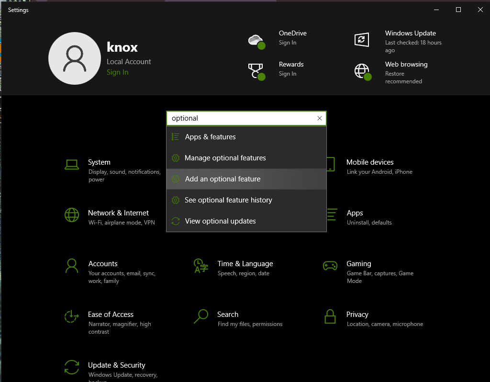
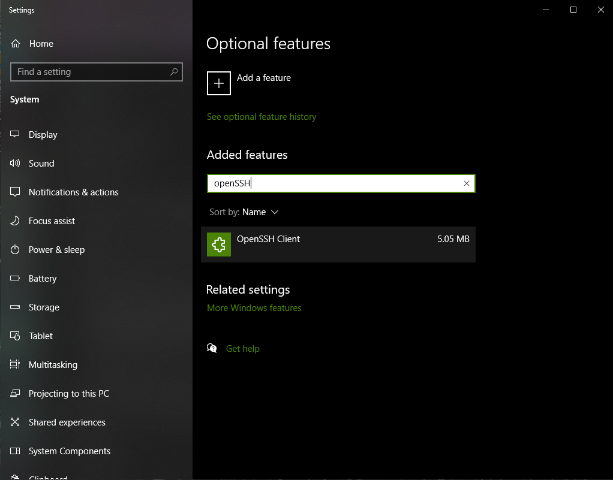
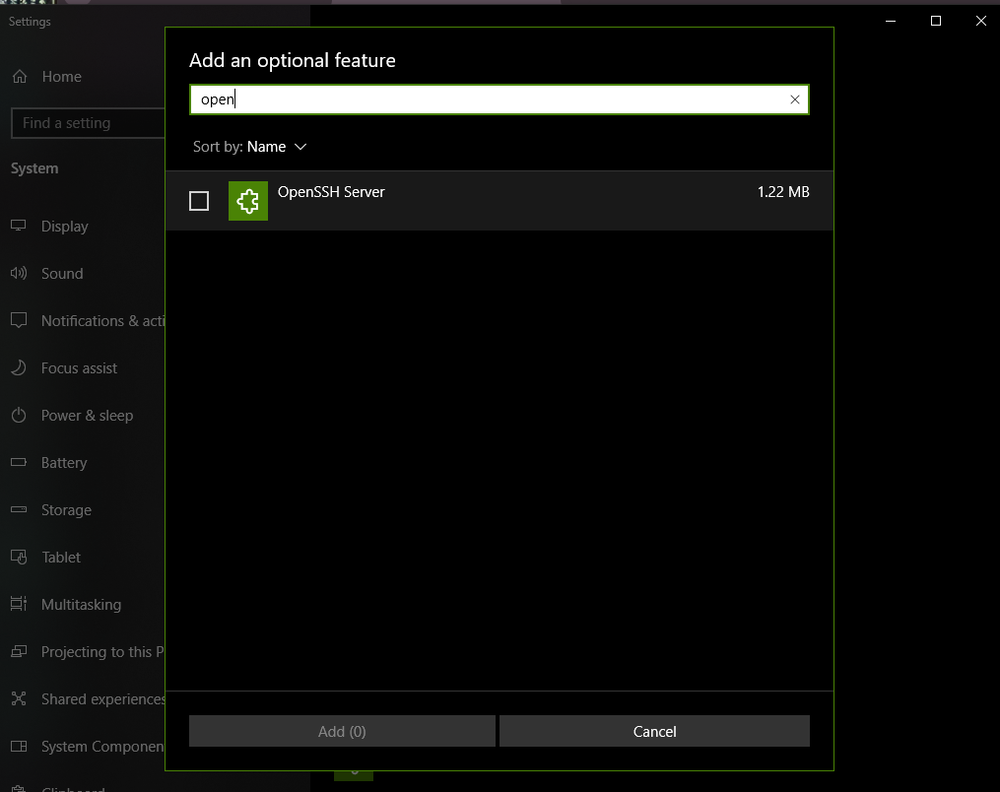

 Customizing Kali Linux and Setting Up Shell GPT

## Initial Setup and System Update

1. Log into Kali Linux
2. Open terminal
3. Update system:
 ```
 sudo apt update
 sudo apt -y upgrade
 ```

## File System Navigation

- `pwd`: Print working directory
- `ls`: List files
- `ls -l`: Detailed file listing
- `ls -lah`: Show hidden files, and human-readable sizes
- `cd`: Change directory
- `mkdir`: Make directory

Create necessary directories:
```
mkdir ~/repos
cd ~/repos
mkdir notes
```

## Installing Required Tools

Install Git and btop:
```
sudo apt install git btop
```

Check if OpenSSH is installed:
```
sudo apt install openssh-server
```

Enable and start SSH service:
```
sudo systemctl enable ssh
sudo systemctl start ssh
sudo systemctl status ssh
```

## Setting Up SSH on Windows

1. Install OpenSSH Client and Server:
 - Go to Start Menu > Optional Features
 
 - Add OpenSSH Client and OpenSSH Server
 
 - Verify installation
 

2. Generate SSH key (open PowerShell as admin):
 ```
 ssh-keygen
 ```

3. On Kali, create .ssh directory:
 ```
 mkdir ~/.ssh
 ```

4. Copy SSH key from Windows to Kali (run in PowerShell):
 ```
 type $env:USERPROFILE\.ssh\id_rsa.pub | ssh username@ip_address "cat >> ~/.ssh/authorized_keys"
 ```

## Setting Up Cursor IDE

1. Download and install Cursor IDE from:
 https://cursor.sh/

2. Open Cursor IDE
3. Connect to remote host (Kali Linux VM)
4. Navigate to the `~/repos/notes` directory

## Installing Shell GPT

1. Install Shell GPT:
 ```
 python3 -m pip install shell-gpt
 ```
 For more information, visit the Shell GPT GitHub repository:
 https://github.com/TheR1D/shell_gpt

2. Add Shell GPT to PATH:
 ```
 export PATH=$PATH:~/.local/bin
 ```

3. Get OpenAI API key from:
 https://platform.openai.com/api-keys

4. Run Shell GPT for the first time:
 ```
 sgpt "Please introduce yourself"
 ```

5. Enter your OpenAI API key when prompted

## Using Shell GPT

Basic usage:
```
sgpt "Your question or command here"
```

For generating commands:
```
sgpt -s "Describe the command you want"
```

Example:
```
sgpt -s "run an nmap scan on the top 1000 ports on 10.10.10.10 and output in XML"
```

This will generate the nmap command, which you can then execute, describe, or abort.

## Additional Tips

- Use the up arrow key to access previously run commands in the terminal
- Use the `history` command to see a list of all commands run in the current session
- `btop` is a system monitoring tool that can be used to view CPU, memory, and process information

## Important URLs

- Cursor IDE: https://cursor.sh/
- Shell GPT GitHub Repository: https://github.com/TheR1D/shell_gpt
- OpenAI API Keys: https://platform.openai.com/api-keys